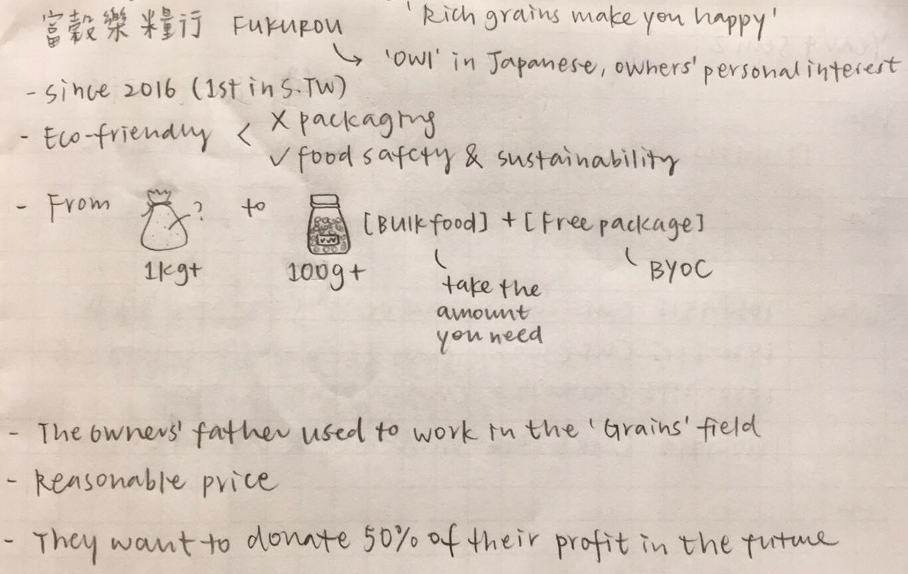
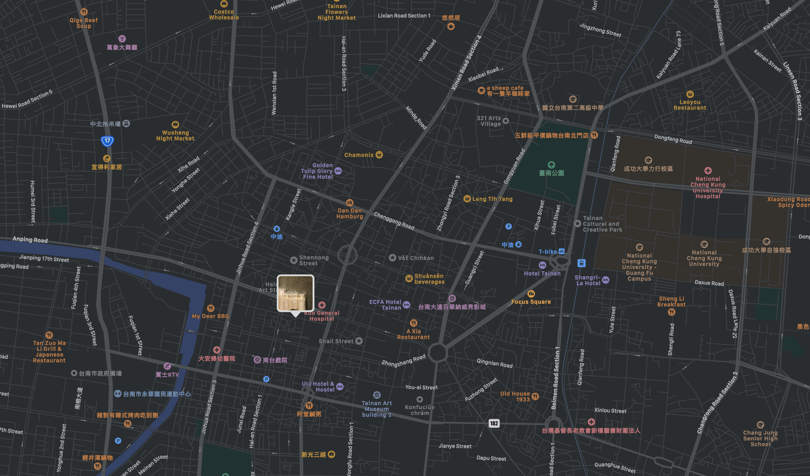
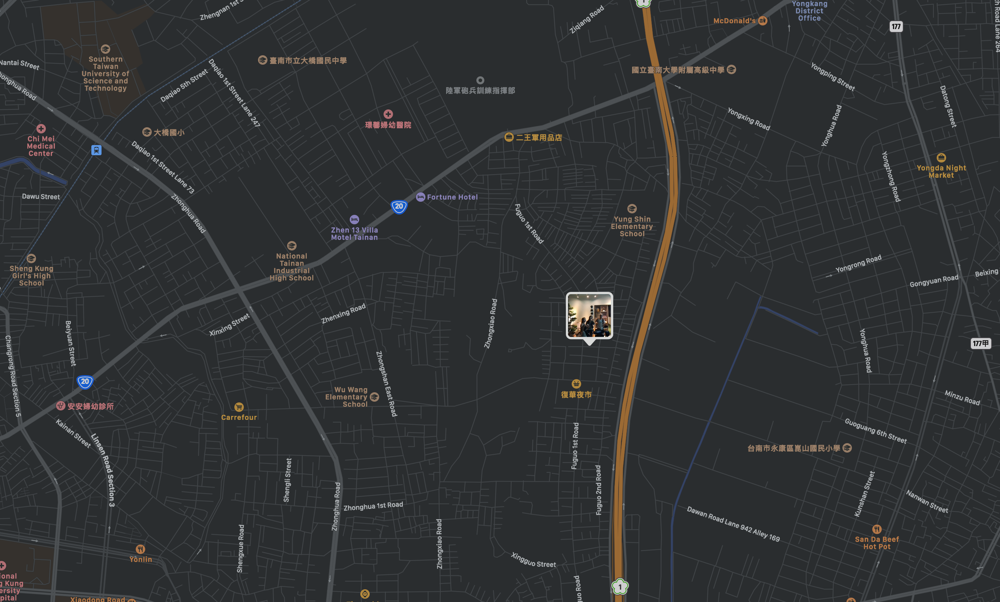

# Creative Waste

As foreign students, plastic and packaging waste is one of the issues we realised when we look around Tainan. We see restaurants and sellers giving us plastic whenever we want it, even though it is unnecessary. We always get plastic cups when we drink, one-use chopsticks when we eat, and a new sheet of paper every time when we make our order. This is a serious problem that we encounter every day.

## When and Where

- *First Visit* - 
For our first visit, we wanted to observehow plastic and packaging waste is made.
Therefore, at noon on 9 October 2019, we went to Shuixian Gong Market, one of the most famous market in Tainan.

- *Second Visit* - 
For our second visit, we wanted to see how the locals reduce the waste.
Therefore, we picked Fukurou, the first package-free store in the southern part of Taiwan, as the destination. We went there at 17:00-19:30 on 22 October 2019.

## How did we get there

- by bus (as tourists)
- by bike, scooter and on foot (as locals)

## How did we document the visits

- photos and note jotting

## How did we communicate

- chats when purchasing goods at the stores / shops
- informal interviews with the shopkeepers

<!-- ## How did we combine and compare those two cases

In our first visit, we observed how plastic and packaging waste is made in one of the most famous market in Tainan; while in the second one, we saw how the locals try to reduce the waste. -->

## With whom 

- locals and shopkeepers

# First Visit: Shuixian Gong Market

Plastic and packaging waste is expectedly serious in the restaurants and stores in Shuixian Gong Market. Plastic cups and paper boxes are provided to the customers, even when they are dining in. For takeaways, plastic bags are also provided to separate each kind of food.

As Shuixian Gong Market is the food market with the longest history of 300+ years in Tainan, some people already hinted us that mostly elderlies go there to shop. However, it looks like a perfect place to us to explore local problems and discuss with the locals. We tried to investigate the core issues of food wasting and all trash creation in Tainan and gain inspirations of nifty improvements that could be implemented.

# Second Visit: Fukurou

Taiwanese or Tainanese street are usually really clean. We can’t see there many litters or waste despite the fact of frequent take-aways and lack of trash bins. But sometimes we can come across these streets that are full of waste. 

This is for us - foreign, exchange students - really confusing and we assume that if the cleanness of the streets were not taken care of by as many people as we see, most streets would look similar. This should be a warning for all of us.

Shopkeeper's name: Lin Pei-jun

